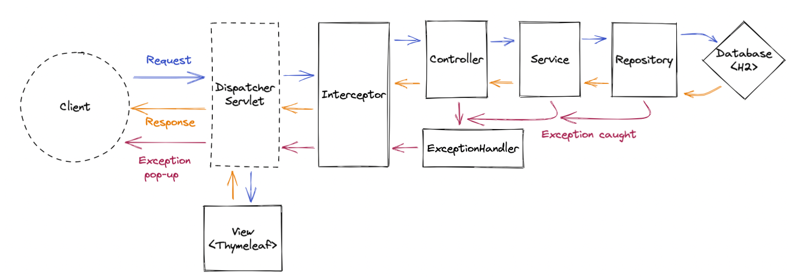
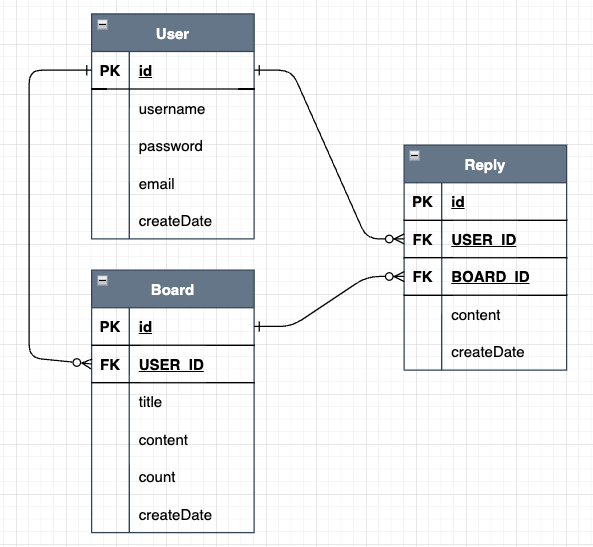
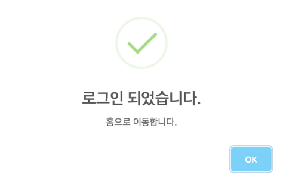
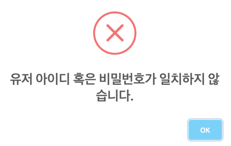

# 스프링 게시판 프로젝트

---

## 개발 환경

### Back-end

- Java version : 11
- Spring Boot version : 2.6.4
- ORM : JPA
- Build tool : Gradle
- Test Framework : JUnit5
- Template Engine : Thymeleaf
- Database : H2

### Front-end

- HTML / CSS
- Ajax

<br>

## 핵심 키워드

- 스프링 MVC 프레임워크 기반 백엔드 서버 구축
- JPA를 활용한 도메인 설계
- Thymeleaf를 활용한 Server Side Rendering 구현

<br>

## 동작 흐름



- Interceptor를 통해 세션 유효 여부를 체크하고, 없을 경우 로그인폼으로 redirect 처리하였습니다.
- @RestControllerAdvice 내 ExceptionHandler를 통해 RuntimeException을 처리하였습니다.

<br>

## ERD



- User, Board, Reply로 구성되어 있는 간단한 구조입니다.
- Board, Reply 간 CascadeType.REMOVE로 지정하여, 함께 life cycle을 가져가도록 적용하였습니다.

<br>

## API 명세

| index | Method | URI | Description |
| --- | --- | --- | --- |
| 1 | GET | /joinForm | 회원가입 폼 요청 |
| 2 | GET | /loginForm | 로그인 폼 요청 |
| 3 | GET | /logoutCheck | 로그아웃 체크 |
| 4 | GET | /saveForm | 게시글 저장 폼 요청 |
| 5 | POST | /login | 로그인 |
| 6 | POST | /logout | 로그아웃 |
| 7 | POST | /board | 게시글 저장 |
| 8 | PUT | /board/{id} | 게시글 업데이트 |
| 9 | DELETE | /board/{id} | 게시글 삭제 |
| 10 | POST | /board/{boardId}/reply | 댓글 저장 |
| 11 | DELETE | /board/reply/{replyId} | 댓글 삭제 |
| 12 | POST | /user | 회원가입 |
| 13 | PUT | /user/{id} | 회원정보 업데이트 |
| 14 | GET | / | 시작 페이지 요청 |
| 15 | GET | /board/{id} | 게시글 상세 요청 |
| 16 | GET | /board/{id}/updateForm | 게시글 수정 폼 요청 |
| 17 | GET | /user/updateForm | 회원정보 업데이트 폼 요청 |

<br>

## 주요 구현 기능
### Thymeleaf & AJAX

- 빠른 페이지 로딩을 위해 Thymeleaf를 사용하여 Server Side Rendering을 구현하였습니다.
- 서버와의 API 통신은 AJAX를 사용하였고, sweetalert라는 스크립트를 활용하여 시각적인 팝업 효과를 주었습니다.

<br>

### 범용 예외 처리

- 쉽게 예외를 확장할 수 있도록 EnumType 예외를 정의하였고, @RestControllerAdvice를 통해 Custom RuntimeException을 처리할 수 있도록 하였습니다.
- 생성된 예외 메시지는 HTTP 상태 코드와 함께 String으로 반환되며, 사용자에게 예외 메시지를 팝업으로 보여주도록 하였습니다.
- javax validation을 활용한 Request Field의 유효성 검증을 통해 비정상적인 요청(empty)을 처리하였습니다.
- 클라이언트에 서버 내부 예외를 숨기면서 의미있는 예외를 전달하기 위해 개발 과정에서 발생한(예상치 못한) RuntimeException을 우선 Catch해서 log를 남기고, 적절한 EnumType 예외를 선언하여 변경해주는 방식으로 처리하였습니다.
    
    ```java
    @ExceptionHandler(value = RuntimeException.class)
    private ResponseEntity<String> handleException(RuntimeException exception) {
        log.warn("RuntimeException 발생", exception);
        return INTERNAL_SERVER_ERROR.getResponse();
    }
    
    // 예시 : 개발 과정에서 예상하지 못한 unique 제약조건 예외 추가
    @ExceptionHandler(value = DataIntegrityViolationException.class)
    private ResponseEntity<String> handleException(DataIntegrityViolationException exception) {
        log.warn("DataIntegrityViolationException 발생", exception);
        return DUPLICATE_ID.getResponse();
    }
    ```
    

> **로그인 성공 시**



> **로그인 실패 시**



<br>

### 단위 테스트

다음 사항을 적용하여 Controller 및 Interceptor에 대한 단위 테스트를 작성하였습니다.

- @WebMvcTest를 통해 Presentation Layer에 속하는 Component만 등록하여 빠른 테스트 진행
- 세션 유무에 따른 Interceptor의 정상 동작 여부 검증
- Controller API Success case에서의 return 값 검증
- 그 외의 Component는 Stub으로 대체

<br>

## 주요 이슈 해결

### 조회 최적화

board 리스트 조회 쿼리가 나간 이후 Template Engine rendering 시점에 lazy loading으로 인한 user 조회 쿼리가 추가로 발생하였습니다. 이를 제거하기 위해 Repository에서 DTO로 Projection을 하도록 처리하였고 쿼리 한 번으로 최적화하였습니다.

```java
@Query("SELECT new com.toyPJT.noticeBoard.dto.BoardSummaryResponse(b.title, b.user.username, b.id, b.count) FROM Board b"
        + " ORDER BY b.id")
Page<BoardSummaryResponse> findBoardSummary(Pageable pageable);
```

Board 단 건 조회 시 user(작성자), replies(답글), replies.user(답글 작성자)가 항상 함께 조회되기 때문에 join을 통해 한꺼번에 조회될 수 있도록 @EntityGraph를 활용하였습니다. 마찬가지로 쿼리 한 번으로 최적화하였습니다.

```java
@EntityGraph(attributePaths = {"user", "replies", "replies.user"})
Optional<Board> findById(Integer id);
```

마지막으로 OSIV(Open-Session-In-View)를 false로 적용하여 위와 같이 Rendering 시점 시 예상치 못한 추가 쿼리 발생을 방지하였습니다.
